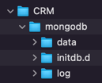

# crmservice

## SET UP

We need to define our environment variables and directories for volumes. So somewhere on your disk, create a folder named CRM
It should look like this:



Then, create a file called create-user.sh inside initdb.d with this content:
```
#!/bin/bash
mongo -u "$MONGO_INITDB_ROOT_USERNAME" -p "$MONGO_INITDB_ROOT_PASSWORD" --authenticationDatabase "$rootAuthDatabase" "$MONGO_INITDB_DATABASE" --eval "db.createUser({ user: '$MONGO_DB_USERNAME', pwd: '$MONGO_DB_PASSWORD', roles: [{ role: 'dbOwner', db: '$MONGO_INITDB_DATABASE' }] })"
```

Create a file called .env inside CRM with this content (replacing the paths, AWS key and secret):

```
# host ports
SERVER_HOST_PORT=8081
MONGO_HOST_PORT=9090
REDIS_HOST_PORT=9091
# host paths to mount
MONGO_DATA_HOST_PATH="/Users/cristiancastagna/rviewerChallenges/CRMService/CRM/mongodb/data"
MONGO_LOG_HOST_PATH="/Users/cristiancastagna/rviewerChallenges/CRMService/CRM/mongodb/log"
MONGO_INITDB_SCRIPTS_HOST_PATH="/Users/cristiancastagna/rviewerChallenges/CRMService/CRM/mongodb/initdb.d"
# application
APP_NAME=crmservice
NETWORK_NAME=crm-network
ENCODER_STRENGTH=10
# mongodb
MONGO_AUTO_INDEX_CREATION=true
MONGO_ROOT_USERNAME=root
MONGO_ROOT_PASSWORD=root
MONGO_DB=crm
MONGO_DB_USERNAME=user1
MONGO_DB_PASSWORD=user1
# aws
AWS_ACCESS_KEY=YOUR_KEY
AWS_SECRET_KEY=YOUR_SECRET
AWS_BUCKET_NAME=crm-service-bucket
AWS_S3_ENDPOINT_URL=https://s3.us-east-1.amazonaws.com
```

Before running docker-compose, we need to create the network

``docker network craete crm-network``

Next, assemble the library JAR:

``./gradlew build``

build the containers (replacing the path):

``` 
docker-compose --env-file "/Users/cristiancastagna/rviewerChallenges/CRMService/CRM/.env" build 
```

run (replacing the path):

``` 
docker-compose --env-file "/Users/cristiancastagna/rviewerChallenges/CRMService/CRM/.env" up -d 
```

#### IMPORT THIS [POSTMAN COLLECTION](CRMService.postman_collection.json)
